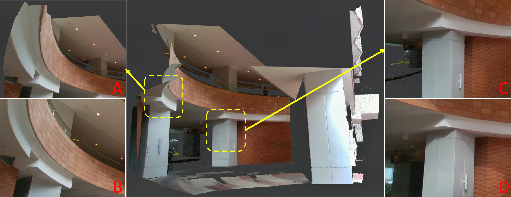

# lidar_camera_calib
**lidar_camera_calib** is a robust, high accuracy extrinsic calibration tool between high resolution LiDAR (e.g. Livox) and camera in targetless environment. Our algorithm can run in both indoor and outdoor scenes, and only requires edge information in the scene. If the scene is suitable, we can achieve pixel-level accuracy similar to or even beyond the target based method.

    
    An example of a outdoor calibration scenario. We color the point cloud with the calibrated extrinsic and compare with actual image. A and C are locally enlarged
views of the point cloud. B and D are parts of the camera image
corresponding to point cloud in A and C.

## Info
New features:
1. Support muti-scenes calibration (more accurate and robust)

## Related paper
Related paper available on arxiv:  
[Pixel-level Extrinsic Self Calibration of High Resolution LiDAR and Camera in Targetless Environments](http://arxiv.org/abs/2103.01627)
## Related video
Related video: https://youtu.be/e6Vkkasc4JI
# noted_pixel_calibration
This document is a code analysis of pixel level calibration, aiming at consisting more people to gain a better understanding of the procedure workflow. Especially, crucial functions are explained specifically such as feature extration, projection etc. 
**lidar_camera_calib** is a robust, high accuracy extrinsic calibration tool between high resolution LiDAR (e.g. Livox) and camera in targetless environment. Our algorithm can run in both indoor and outdoor scenes, and only requires edge information in the scene. If the scene is suitable, we can achieve pixel-level accuracy similar to or even beyond the target based method.

## Related paper
Related paper available on arxiv:  
[Pixel-level Extrinsic Self Calibration of High Resolution LiDAR and Camera in Targetless Environments](http://arxiv.org/abs/2103.01627)

## Link to the Chinese translated version of the paper
https://zhuanlan.zhihu.com/p/561893166

## Related video
Related video: https://youtu.be/e6Vkkasc4JI

